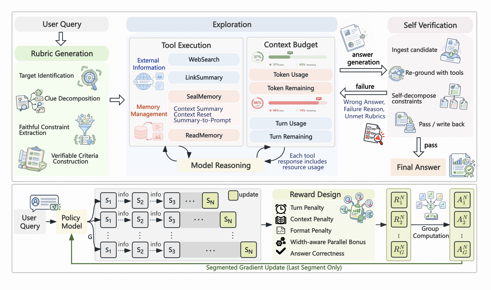

# Traverse: Learning When to Remember, Reset, and Redirect for Long-Horizon Web Search

### Official Inference and Evaluation Harness

[Paper](https://arxiv.org/abs/2609.37082) · [Training Data](https://huggingface.co/datasets/ByteDance-BandAI/Traverse-AutoGen)

This is the official harness for **Traverse**.

<p align="center">
  
</p>

Long-horizon information-seeking agents often accumulate noisy or misleading evidence. Early mistakes can persist across many turns, bias later decisions, and eventually trap the agent in an unproductive search path. Traverse addresses this problem with a structured **Rubric–Answer–Verify** workflow and an agent-controlled memory mechanism. The agent first defines what a correct answer must satisfy, searches under those criteria, and then independently verifies its own answer before deciding whether to stop or continue searching.

This repository contains the runtime used to execute that workflow, connect it to external search tools, collect trajectories, and evaluate results across long-horizon search benchmarks. The Traverse model weights and training stack are separate from this harness. We will also release [Traverse-AutoGen](https://huggingface.co/datasets/ByteDance-BandAI/Traverse-AutoGen), a subset of 8,617 automatically generated information-seeking question-answer pairs used in our training pipeline.

## Method

Traverse organizes the search process into three states:

- **Rubric** decomposes the question into explicit criteria that a valid answer must satisfy.
- **Answer** gathers and synthesizes evidence with web-search and page-reading tools.
- **Verify** independently checks the candidate answer against the question, the rubrics, and external evidence. If verification fails, the agent returns to Answer with targeted feedback.

During Answer and Verify, the agent can invoke **Seal Memory** to preserve verified facts, contradictions, failed hypotheses, unexplored leads, and its next-step plan before resetting the active context. **Read Memory** allows the agent to recover additional details from the saved checkpoint when necessary. This lets context transitions respond not only to length limits, but also to semantic stagnation recognized by the agent itself.

The paper further trains this behavior with masked supervised fine-tuning and a final-segment-only reinforcement-learning strategy designed to prevent *Seal Collapse*. This repository focuses on the inference and evaluation harness that realizes the learned behavior at runtime.

## Installation

Traverse requires Python 3.11 or later and is run directly from the repository root.

```bash
git clone https://github.com/ByteDance-BandAI/Traverse.git
cd Traverse
uv sync
```

The harness communicates with models through an OpenAI-compatible `/v1/chat/completions` endpoint, including local vLLM and SGLang deployments.

```bash
export OPENAI_API_KEY="EMPTY"
export OPENAI_BASE_URL="http://localhost:8000/v1"
```

Example model configurations are provided in `configs/llm/`.

## Search Tools

The search and page-reading backends are deployment-specific and are not bundled with the repository. Connect your own synchronous or asynchronous Python functions:

```python
# my_tools.py
async def search(query: str, num: int):
    return await your_search_service(query=query, num=num)

async def link_summary(question: str, url: str | list[str]):
    return await your_page_reader(question=question, url=url)
```

Functions may be referenced as either `module:function` or `/path/to/file.py:function`. The harness handles tool-schema validation, retries, timeouts, and output normalization. See [`tools/function_tools.py`](tools/function_tools.py) for the accepted return formats.

## Quick Start

The command below runs the complete Rubric–Answer–Verify workflow with Seal and Read Memory enabled:

```bash
BENCHMARK=gaia \
SEARCH_TOOL_FUNCTION=my_tools:search \
LINK_SUMMARY_TOOL_FUNCTION=my_tools:link_summary \
AGENT_MODEL_NAME=Traverse-35B \
JUDGE_MODEL_NAME=your-judge-model \
SKIP_RUBRICS=false \
SKIP_VERIFY=false \
MAX_TURNS=512 \
MAX_VERIFY=3 \
AGENT_TEMPERATURE=1.0 \
AGENT_MAX_TOKENS=262144 \
bash recipe/fsm_agent/scripts/run_benchmark.sh
```

`AGENT_MODEL_NAME` should match the name exposed by your model endpoint. Set `NUM_QUESTIONS` to limit the evaluation set, `ROLLOUT_N` to control the number of samples per question, `CONCURRENCY` to control parallelism, and `WORK_DIR` to select the output directory.

Set `DRY_RUN=true` to validate the assembled configuration without making model requests. The launch script also supports pre-generated rubrics, trajectory-level retries, automatic resumption, alternate context-compaction strategies, and independent Answer/Verify budgets.

## Benchmarks

The repository provides evaluation profiles for BrowseComp-Lite-185, BrowseComp-ZH, GAIA text-only, xbench-DeepSearch, DeepSearchQA, and WideSearch. Benchmark data that can be redistributed is prepared automatically from pinned revisions; datasets with separate access terms must be supplied through `DATASET_PATH`.

### BrowseComp-Lite-185 (BC185)

The full BrowseComp benchmark contains 1,266 questions and is expensive to run repeatedly because each question requires a long-horizon interaction with Web search tools. For efficient model development and ablation studies, the paper introduces **BrowseComp-Lite-185 (BC185)**, a fixed 185-question subset selected to closely approximate full-set performance. We form candidate subsets from a fixed random permutation, then calibrate their accuracy against historical full-set results from five Best-of-1 runs and four Best-of-5 runs. In this calibration, BC185 keeps the observed subset-to-full-set deviation within three percentage points for Best-of-1 and five points for Best-of-5.

To make this evaluation setting reusable without redistributing BrowseComp questions or answers, we provide the exact subset as an ID-only manifest: [`benchmark_subsets/browsecomp_185_ids.txt`](benchmark_subsets/browsecomp_185_ids.txt). Each `test_N` entry refers to zero-based row `N` in the original 1,266-question BrowseComp test set. After obtaining BrowseComp through its original distribution channel, the subset can be reconstructed directly:

```python
from pathlib import Path

subset_ids = set(
    Path("benchmark_subsets/browsecomp_185_ids.txt").read_text().splitlines()
)
bc185 = [
    row for index, row in enumerate(browsecomp_rows)
    if f"test_{index}" in subset_ids
]
```

```bash
BENCHMARK=dsqa \
SEARCH_TOOL_FUNCTION=my_tools:search \
LINK_SUMMARY_TOOL_FUNCTION=my_tools:link_summary \
AGENT_MODEL_NAME=Traverse-35B \
JUDGE_MODEL_NAME=gemini-2.5-flash \
SKIP_VERIFY=false \
bash recipe/fsm_agent/scripts/run_benchmark.sh
```

Each run produces a `review.jsonl` file with per-rollout answers and judge decisions, a `metric_report.json` summary, and complete per-question trajectories for analyzing search, verification, context resets, and memory use.

## Code Structure

| Path | Description |
| --- | --- |
| `agents/self_verify_agent.py` | Rubric–Answer–Verify state machine |
| `agents/seal_memory_agent.py` | Context reset and memory orchestration |
| `tools/memory_tools.py` | Seal Memory and Read Memory tools |
| `tools/function_tools.py` | External search and page-reader adapters |
| `recipe/fsm_agent/` | Traverse prompts, launch entry point, and benchmark scripts |
| `rollout/` | Concurrent rollout, retries, resumption, and trajectory management |
| `verifiers/` | Benchmark-specific judges and scoring logic |

## Citation

If you use Traverse, please cite:

```bibtex
@misc{ma2026traverselearningrememberreset,
      title={Traverse: Learning When to Remember, Reset, and Redirect for Long-Horizon Web Search},
      author={Jingyuan Ma and Lynx Aster and He Zhang and Siyao Song and Weijie Yuan and Zhe Zhang and Kai Jia and Zhifang Sui},
      year={2026},
      eprint={2609.37082},
      archivePrefix={arXiv},
      primaryClass={cs.CL},
      url={https://arxiv.org/abs/2609.37082},
}
```

## License

Except where otherwise noted by a file-level SPDX identifier, this project is licensed under the [Apache License 2.0](LICENSE).
